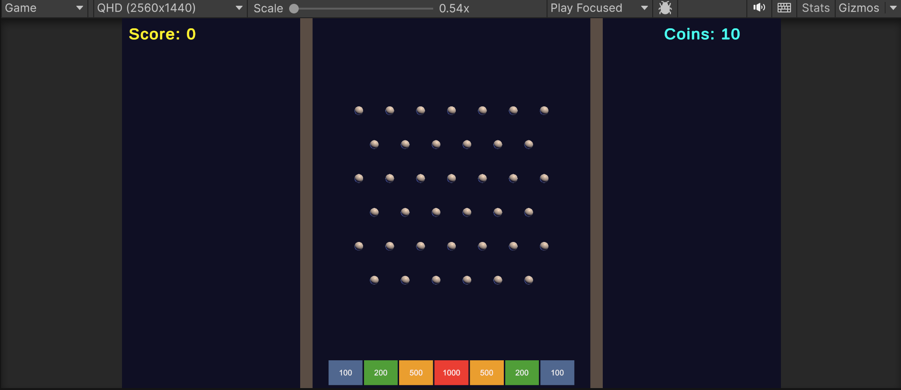

# コイン落としゲーム

Plinko スタイルのコイン落としゲームです。  
クリックした位置からコインを落とし、ペグに弾かれながらスコアゾーンへ導こう！

🎮 **[ブラウザでプレイ](https://masafy.itch.io/coin-drop)**



## ゲームルール

- 画面をクリックした位置からコインを落下
- コインはペグに当たって予測不能に跳ね返る
- 下部のスコアゾーンに入ると得点
- コインは全部で **10枚**、合計スコアを競う

| ゾーン | 得点 |
|---|---|
| 外側（青） | 100点 |
| 内側（緑） | 200点 |
| 中央寄り（黄） | 500点 |
| 中央（赤） | 1000点 |

## 特徴

- コインごとにランダムな反発係数・カラー
- 着地時のパーティクルエフェクト＆トレイル
- プロシージャル生成の BGM・SE
- Bloom ポストプロセスによる発光エフェクト

## 開発環境

- **Unity** 6000.4.5f1
- **レンダリング** Universal Render Pipeline (URP)
- **入力** Unity Input System
- **言語** C#

## ビルド方法

```
1. Unity 6 でプロジェクトを開く
2. CoinDrop → Setup Scene を実行
3. File → Build Settings → WebGL → Build
```

## ライセンス

MIT
